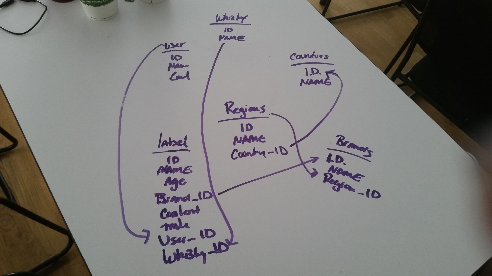
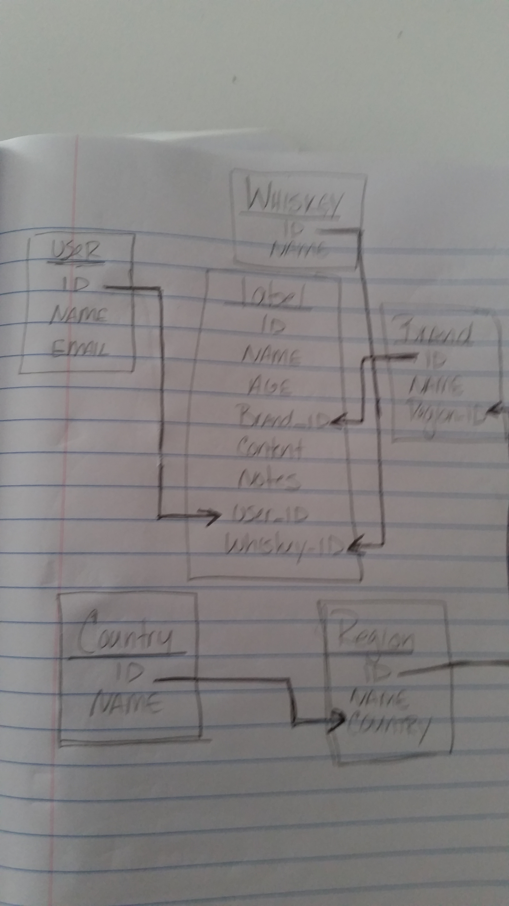
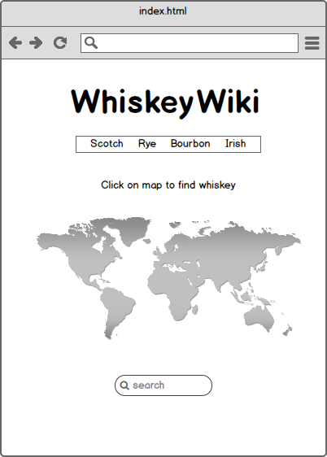
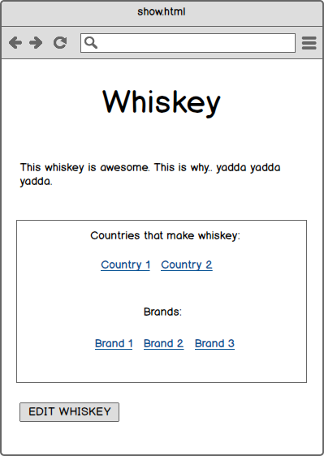
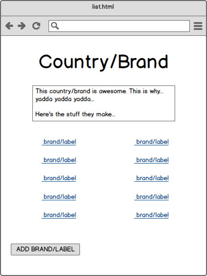
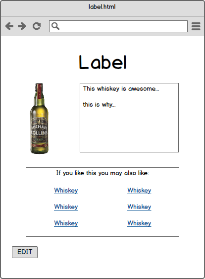
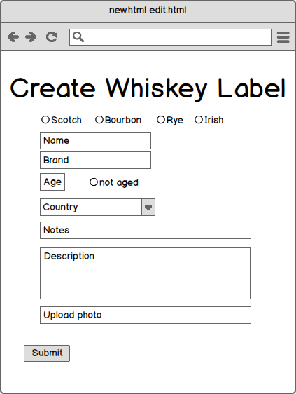
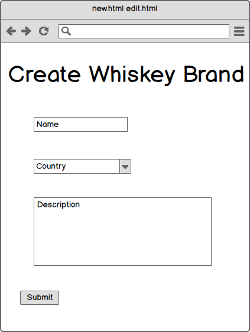

#General Assembly - Project Two - WhiskeyWiki

Raina Koren
August 17, 2015

##Objective
 To create a wiki using the following:
- HTML
- CSS
- JS
- Express
- SQL/Sqlite
- Agile development

##Minimum Viable Product
A basic implementation of this app should probably include:

- All articles should be editable.
- All articles should display an author.
- If an article is changed, the time of that change should be shown.
- Articles must be written in markdown so that the content is visually appealing
- User must receive an email when an article that they've published is edited.
- Users ust be able to add a category to an article so that articles can be organized.
- All users must be able to interact with the wiki, so it must be responsive.

##Initial Sketches

##ERD:

##Wireframe

##Routes and User Stories
 Available on [Trello](https://trello.com/b/vNmiv5nP/whiskeywiki).

##Project Final Features
 - All Labels and brands are editable
 - User can create new label and brand
 - Wiki is responsive
 - It looks awesome!
 - Able to see similar products on label page based on tasting notes
 - Unwilling to implement SendGrid due to concerns of privacy an being shakey on the subject of environmental variables
 - Unable to implement markdown due to time constraints
 - Implementation of user lead to broken code that was not able to be fixed due to time constraints.
